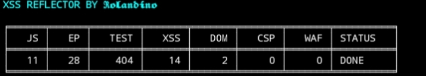

# XSS Reflector



**XSS Reflector** Adalah Tools Otomatis Untuk **Mendeteksi Kerentanan Cross-Site Scripting (XSS)** Dengan Pendekatan **HYBRID**
- Reflected XSS
- Static DOM-Based XSS
- Endpoint Discovery Dari JavaScript
- Analisis Content Security Policy (CSP)
- Deteksi Indikasi WAF

Tool Ini Dirancang Untuk **Bug Bounty, Pentesting, Dan Security Research**

---

## Fitur Utama

 Ekstraksi Endpoint Dari
- HTML Forms
- JavaScript (Fetch, Axios, JQuery, WebSocket, Dll)

 Payload XSS Pintar
- Raw Payload
- URL Encoded
- Base64 Encoded
- Payload Mutation (WAF Bypass Dll)

Deteksi
- Reflected XSS
- Context (HTML / Attribute / JS)
- Static DOM XSS (source → sink)
- CSP Lemah (`unsafe-inline`, `unsafe-eval`)
- WAF (403 / 406)

Severity Scoring
- LOW
- MEDIUM
- HIGH
- CRITICAL

Output Laporan JSON Lengkap ✓

---

## Instalasi

```bash
pip install requests beautifulsoup4 colorama tabulate esprima
git clone https://github.com/opettt-hash/XSSREFLECTOR.git
cd XSSREFLECTOR
python XSS_REFLECTOR.py
```

## Peringatan 
Tool Ini Dibuat Hanya Untuk Tujuan Edukasi Dan Pengujian Keamanan Yang Sah, Gunakan Hanya Pada Target Yang Di Ijinkan !
